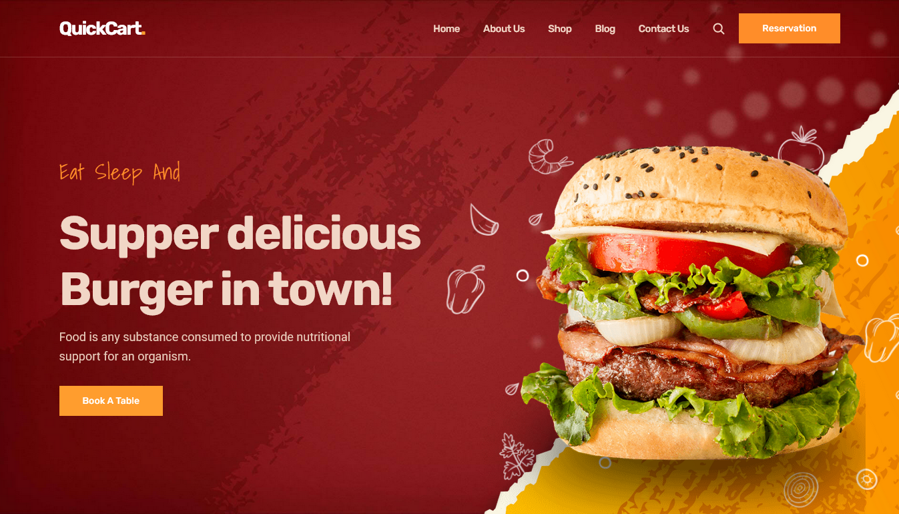

<div align="center">
  
  
  
  
  
  

  <br />
  <br />

  <h2 align="center">QuickCart - Fast food website</h2>

  QuickCart is a fully responsive fast food website, <br />Responsive for all devices, build using HTML, CSS, and JavaScript.

  <a href="https://snatcher.github.io/QuickCart/"><strong>➥ Live Demo</strong></a>

</div>

<br />

### Demo Screeshots



### Prerequisites

Before you begin, ensure you have met the following requirements:

* [Git](https://git-scm.com/downloads "Download Git") must be installed on your operating system.

### Run Locally

To run **QuickCart** locally, run this command on your git bash:

Linux and macOS:

```bash
sudo git clone https://github.com/snatcher/QuickCart.git
```

Windows:

```bash
git clone  https://github.com/snatcher/QuickCart.git
```

### Contact

If you want to contact with me you can reach me at [Twitter](https://www.twitter.com/snatcher_ke).
